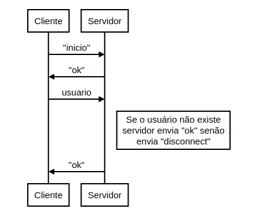
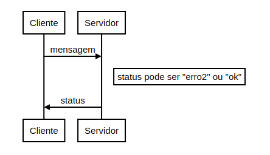
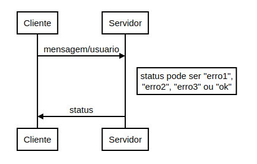
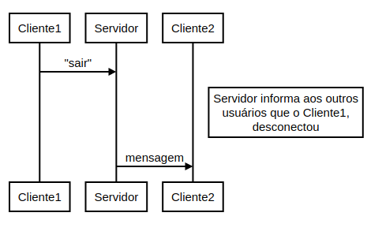

# Projeto e implementação de um protocolo de bate-papo
Protocolo e aplicação desenvolvidos para a disciplina de projeto de protocolos (PTC29008) do curso de Engenharia de Telecomunicações do Instituto Federal de Santa Catarina - campus São José, no primeiro semestre de 2019.
Desenvolvimento das aplicações cliente/servidor foram feitas com base neste [repositório](https://github.com/Rishija/python_chatServer)

## Sumário

* [Especificação do protocolo](#especificação-do-protocolo)
* [Documentação da API do protocolo](#documentação-da-api-do-protocolo)
* [Manual de uso das aplicações](#manual-de-uso-das-aplicações)

## Especificação do protocolo

- **Serviço:** Estabelecimento de conexão, troca de mensagens e encerramento de conexão entre clientes (usuários) do *chat* e o servidor.

- **Ambiente de execução:** Através de *sockets*, cria um canal TCP para comunicação entre clientes e um servidor, que controla o trafego de mensagens do *chat*. Permite o envio de mensagens de um usuário para todos os demais conectados ou ainda o envio de mensagens entre apenas dois usuários (mensagens privadas).

- **Vocabulário:** 
	- **"Inicio":** Mensagem do cliente para o servidor para estabelecimento de conexão.
	- **"sair":** Mensagem do cliente para o servidor para encerramento de sessão
	- **"erro1":** Mensagem do servidor para o cliente informando que o mesmo tentou enviar mensagem privada de maneira equivocada.
	- **"erro2":** Mensagem do servidor para o cliente informando que o cliente está tentando enviar uma mensagem em branco.
	- **"erro3":** Mensagem do servidor para o cliente informando que o cliente está tentando enviar mensagem privada para um outro cliente que não está conectado naquele momento.
	- **"disconnect":** Mensagem do servidor para o cliente informando que o estabelecimento da conexão não será possível (cliente não iniciou a troca de mensagens com a palavra "inicio" ou o cliente está informando um nome de usuário já existente).
	- **"ok":** Mensagem do servidor para o cliente informando que a conexão foi estabelecida ou que uma mensagem enviada foi tratada de forma adequada.

- **Codificação:** As mensagens trocadas entre clientes e servidor são na forma de texto (*strings*).

- **Comportamento:**

	- **Estabelecimento de conexão:** 
	

	- **Mensagem para todos os clientes:** 
	
	
	- **Mensagem privada:** 
	
	- **Encerramento de sessão:** 
	
	

## Documentação da API do protocolo

A API conta com métodos para implementação do protocolo, tanto do lado do servidor quanto dos clientes.

- **Cliente e servidor**
                    
| Método                | Descrição                     | Parâmetros                  |Retorno|
| ---------------------- | ------------------------------ | ------------------------------ |----|
| Chat(host, port, server)             | Constrói o objeto Chat      | **host:** IP do servidor **port:** porta do servidor  **server:** se *true* indica que o objeto construido será o servidor | Nenhum |
|getConnection() |Retorna o objeto *socket* da conexão entre cliente e servidor  |Nenhum |Objeto *socket*|
|closeConnection(sockobj) |Encerra a comunicação entre cliente e servidor |**sockobj:** objeto *socket* da conexão que será encerrada |Nenhum |

- **Servidor:**
                    
| Método                 | Descrição                     | Parâmetros                  |Retorno |
| -------------  | ------------------------------ | ------------------------------ |-----------|
|getConnected()                              |Retorna uma lista de objetos *socket* com os usuários conectados ao servidor                                     |  Nenhum                              |Lista de objetos *socket*  |
|serverSetConnection(sockobj)  |Estabelece conexão entre o servidor e um cliente  | **sockobj:**  objeto *socket* que irá estebelecer conexão com o servidor  | Nenhum |
|sendStatus(msg, sockobj) | Envia mensagem de *feedback* ao cliente |**msg:** *string* com o status a ser enviado **sockobj:** objeto socket do cliente que receberá a mensagem | Nenhum |
 |getSender(sockobj) |Retorna o usuário que enviou uma mensagem |**sockobj:** objeto *socket* da conexão entre cliente e servidor |Retorna uma string com o nome do usuário que enviou a mensagem |
 |disconnect(sockobj, sender)  |Remove o usuário da lista de conexões do servidor e informa aos demais clientes   |**sockobj:** objeto *socket* da conexão a ser encerrada **sender:** *string* com o nome do usuário a encerrar a conexão  |  Nenhum |
 | serverSendPrivateMessage(sockobj,sender,receiver,msg) |Método para que o servidor envie uma mensagem privada  |**sockobj:** objeto *socket* do cliente que quer enviar a mensagem **sender:** *string* com o nome do cliente que enviou a mensagem **receiver:** *string* com o nome do cliente que receberá a mensagem **msg:** *string* com a mensagem a  ser enviada  | Nenhum |
 |serverSendMessagetoAll(sockobj, msg) |Método para que o servidor envie mensagens para todos os usuários |**sockobj:** objeto *socket* da conexão do cliente que enviou a mensagem **msg:** *string* com a mensagem a ser enviada | Nenhum

- **Cliente:**
                    
| Método                 | Descrição                     | Parâmetros                  |Retorno |
| -------------  | ------------------------------ | ------------------------------ |-----------|
| setUser(user)  | Define o nome de usuário do cliente   |**user:**  *string* com o nome do usuário  | Nenhum   |   
|clientSetConnection() |Estabelece a conexão entre cliente e servidor | Nenhum | Retorna *true* se a conexão foi bem sucedida. Retorna *false* caso contrário |
|clienteSendMessage(msg) |Método do cliente para enviar mensagem para o servidor |**msg:** *string* com a mensagem a ser enviada | Nenhum |
| receiveMessage()| Método para recebimento de mensagens por parte do cliente  | Nenhum |Retorna uma *string* com a mensagem recebida |

## Manual de uso das aplicações

### **Servidor:**
Para executar o servidor (o programa será executado com o IP 127.0.0.1):
> $ python server.py [porta]

<pre>
Servidor está online
</pre>

### **Cliente:**
Para executar o cliente (o programa será executado com o IP 127.0.0.1):
> $ python cliente.py [porta]
	
<pre>
Digite nome de usuário:
Ana
Bem vindo a sala de conversa
Voce:
</pre>

Caso o nome de usuário já exista, a aplicação irá encerrar:

<pre>
Digite nome de usuário:
Ana
Nome de usuario ja existente
</pre>

Para enviar mensagem privada a sintaxe deve ser "privado;usuario:mensagem":

<pre>
Voce: privado;Ana:Ola Ana 
</pre>

Para sair do *chat* basta digitar "sair":

<pre>
Voce: sair
</pre>

